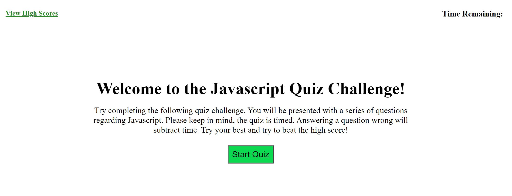
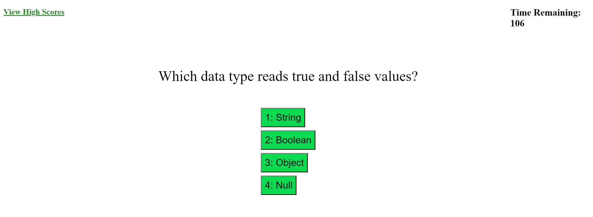
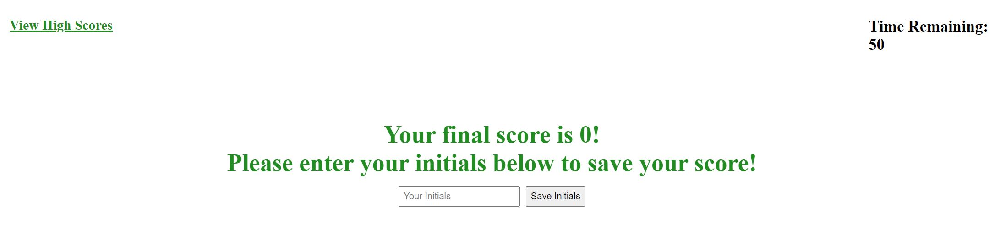

# Javascript-Quiz
Welcome to Javascript Quiz! Consisting of 5 questions, user can test their Javascript knowledge.

## Table of Contents
* Intro
* Quiz Starting Screen
* Quiz Questions
* Quiz Ending Screen
* High Scores
* Conclusion

## Intro
Welcome to the Javascript Quiz. This multiple choice quiz consists of 5 questions. Each question is related to Javascript. The user will have 2 minutes to complete the quiz. Each question has 4 possible answers displayed in multiple choice format. At the end of the quiz, users will enter their initials to see if they have beat the high score.

## Quiz Starting Screen
Once the webpage has loaded, users will be presented with the starting screen of the Javascript Quiz. Below is a screenshot of what the user will see once the webpage loads:

The user will then just have to simply click on the green "Start Quiz" button to start the quiz.

## Quiz Questions
The quiz consist of 5 different Javascript questions. Each question has 4 different possible answers. Below is a screenshot of what the user will see once they click the "Start Quiz" button and are prompted with the first question:

Once the user clicks on an answer, the next question will pop up. This will continue to happen until the user has answered the final question.

## Quiz Ending Screen
Once the user has answered the final question, a screen will pop up displaying the user's score and will prompt the user to enter their initials. See the screenshot below for an example of this:

Once the user enters their initials, their initials and high score are saved in local storage.

## High Scores
The user can click on the View High Scores tab on the top left of the webpage to display the current high score for the quiz. The high scores used local storage to determine which score should be saved.

## Conclusion
The Javascript quiz provides users with a fun way to practice their Javascript knowledge.
Please use the link below to go straight to Javascript Quiz!
